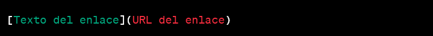
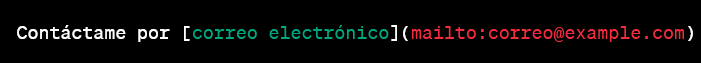
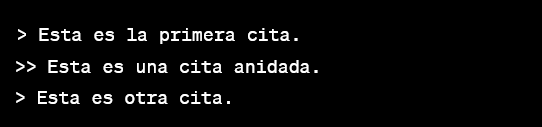
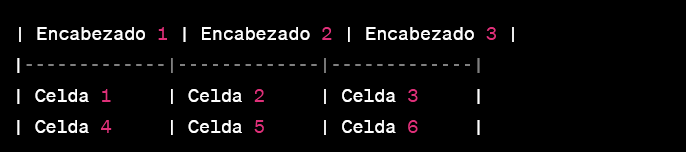
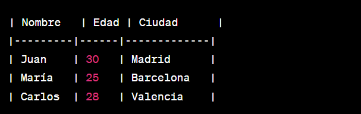
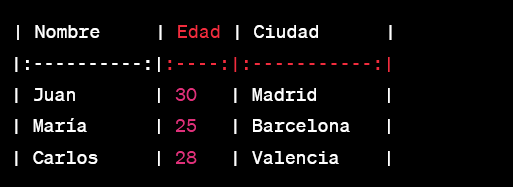

# Los títulos en Markdown 
Los títulos en Markdown se crean utilizando el carácter numeral #. Cuantos más caracteres de numeral coloques al principio de la línea, más pequeño será el título que obtendrás.

# Hola Mundo
## Hola Mundo
### Hola Mundo
#### Hola Mundo
##### Hola Mundo
###### Hola Mundo


# Markdown y sus diferentes estilos de texto

### Cursiva (Italic):
 Para escribir texto en cursiva en Markdown, simplemente coloca un asterisco * o un guion bajo _ al principio y al final de la palabra o frase que deseas resaltar en cursiva

 *Texto en cursiva* o _Texto en cursiva_

 ### Negrita (Bold): 
 Para resaltar texto en negrita en Markdown, debes utilizar dos asteriscos ** o dos guiones bajos __ al principio y al final de la palabra o frase que deseas enfatizar. 

 **Texto en negrita** o __Texto en negrita__

 ### Cursiva y Negrita (Italic y Bold): 
 Si deseas combinar ambos estilos, puedes utilizar tres asteriscos *** o tres guiones bajos ___ al principio y al final del texto.

 ***Texto en cursiva y negrita*** o ___Texto en cursiva y negrita___

 ### Tachado (Strikethrough):
  Para agregar texto tachado en Markdown, coloca dos virgulillas ~~ al principio y al final de la palabra o frase que deseas tachar. 

  ~~Texto tachado~~

  ### Subrayado (Underline): 
  El subrayado no es parte de la especificación oficial de Markdown, pero algunos editores de Markdown lo admiten. Puedes utilizar etiquetas HTML <u></u> para lograr el subrayado en aquellos editores que lo soporten:

  <u>Texto subrayado</u>


  # Listas
  En Markdown, puedes crear diferentes tipos de listas para organizar y presentar la información de manera estructurada. Aquí están los tres tipos de listas más comunes en Markdown:

  ### Lista desordenada (unordered list): 
  Se crea utilizando asteriscos *, guiones - o signos más + al principio de cada elemento de la lista. Cada elemento de la lista se representa con un punto, y el orden en que se escriben los elementos no importa. 
  * Elemento 1
  * Elemento 2
  * Elemento 3 

  ### Lista ordenada (ordered list): 
  Se crea utilizando números seguidos de un punto al principio de cada elemento de la lista. La numeración de los elementos se ordena automáticamente.

  1. Elemento A
  2. Elemento B
  3. Elemento C

  ### Lista de tareas (task list):
   Este tipo de lista es específico de Markdown y se utiliza para crear listas de tareas con casillas de verificación. Se crea utilizando un guión - seguido de corchetes cuadrados [] y un espacio para las tareas pendientes y un guion seguido de corchetes cuadrados con una "x" dentro [*] para las tareas completadas

   - [ ] Tarea 1
   - [x] Tarea 2
   - [ ] Tarea 3


   # Generar enlaces 
   <u>1. Enlaces web:</u>

   Crear enlaces en Markdown es muy sencillo y te permite vincular palabras o frases con otras páginas web o recursos. Para crear un enlace en Markdown, puedes utilizar la siguiente sintaxis:

   

   Donde:

   * ___Texto del enlace___: Es el texto que se mostrará como el enlace en el documento.
   * ___URL del enlace___: Es la dirección URL a la que se dirigirá el enlace.

    

   [Visita Google](https://www.google.com)

   Cuando se renderiza el Markdown, verás que el texto "Visita Google" se muestra como un enlace, y al hacer clic en él, te llevará a la página web de Google.

   También puedes crear enlaces sin mostrar la URL completa, simplemente escribiendo la dirección web directamente. Por ejemplo:

   Puedes visitar [mi sitio web](https://www.ejemplo.com) para más información.

   <u>2. Enlaces de correo electrónico:</u>

   Para crear un enlace de correo electrónico en Markdown, utiliza la siguiente sintaxis:
   
   

   Donde:

   * ___Texto del enlace___: Es una descripción de la imagen que se mostrará si la imagen no puede cargarse o para fines de accesibilidad. Es recomendable siempre proporcionar un texto alternativo significativo.

   * correo@example.com: Es la dirección de correo electrónico que se utilizará como destino del enlace.
   

   

   Resultado:

   Contáctame por [correo electrónico](mailto:correo@example.com)

   # Citas
   Las citas en Markdown son útiles para resaltar extractos importantes de un texto o para agregar referencias y atribuciones. Puedes combinar citas con otros elementos de Markdown, como enlaces e imágenes, para crear contenido estructurado y legible.

   Simplemente coloca el símbolo mayor que (>) al principio de la línea donde deseas que aparezca la cita. Puedes usar múltiples símbolos mayores (>>, >>>, etc.) para anidar citas o citar múltiples párrafos.Para crear citas en Markdown, puedes utilizar el siguiente formato:

   

   Resultado:

   >Texto de la cita

   Si deseas anidar citas, puedes hacerlo agregando más símbolos mayores:

   

   Resultado:
   > Esta es la primera cita.
   >> Esta es una cita anidada.
   > Esta es otra cita.


   # Generar línea divisora

   Para generar una línea divisora en Markdown, puedes utilizar tres o más guiones (-), asteriscos (*), o guiones bajos (_) en una línea por sí solos. También puedes dejar espacios entre ellos. La cantidad de guiones, asteriscos o guiones bajos no importa, siempre que haya al menos tres caracteres en la línea. Aquí tienes algunos ejemplos:

   1.

   2.

   3.

   Resultado:
   ***
   ___
   ---

   Puedes utilizar esta línea divisora para separar secciones en tu documento o para mejorar la legibilidad y organización del contenido. La línea divisora no tiene un propósito semántico, simplemente proporciona una separación visual en el texto.

   # Mostrar codigo

   1. Para mostrar código en Markdown, puedes utilizar varias opciones, dependiendo de la longitud y el lenguaje de programación del código. 

   `console.log`

2. Usando la etiqueta "javascript" después de los tres acentos graves de apertura (```) le indicas a Markdown que debe resaltar la sintaxis del código como JavaScript. De esta manera, se mostrará con colores y formato adecuado para este lenguaje.
  ```javascript
   console.log("Hola Mundo")
   ```

   Markdown admite una variedad de etiquetas para resaltar la sintaxis de muchos lenguajes de programación, lo que facilita la presentación de código en tus documentos y publicaciones.

   # Generar tablas
   Para generar tablas en Markdown, puedes utilizar la siguiente sintaxis:

   
   

Donde:

* Cada línea delimitada por | representa una fila de la tabla.
+ La segunda línea, que consiste en --- o -|-, se utiliza para separar el encabezado de la tabla del contenido.
+ Las celdas se separan mediante |.

Ejemplo:



Resultado:

| Nombre   | Edad | Ciudad      |
|---------|------|-------------|
| Juan    | 30   | Madrid      |
| María   | 25   | Barcelona   |
| Carlos  | 28   | Valencia    |

Si no especificas ninguna opción de alineación, el contenido en las celdas se alineará a la izquierda de manera predeterminada.


Las opciones de alineación para las tablas en Markdown son las siguientes:

+ **:---**  Alineación izquierda.
+ **---:**  Alineación derecha.
+ **:---:** Alineación centrada.

Estas opciones se agregan en la segunda línea de la tabla, justo después de los guiones (-) que separan los encabezados del contenido. Por ejemplo:



Resultado:

| Nombre     | Edad | Ciudad      |
|:----------:|:----:|:-----------:|
| Juan       | 30   | Madrid      |
| María      | 25   | Barcelona   |
| Carlos     | 28   | Valencia    |


   


   
  


   


   


   

  


